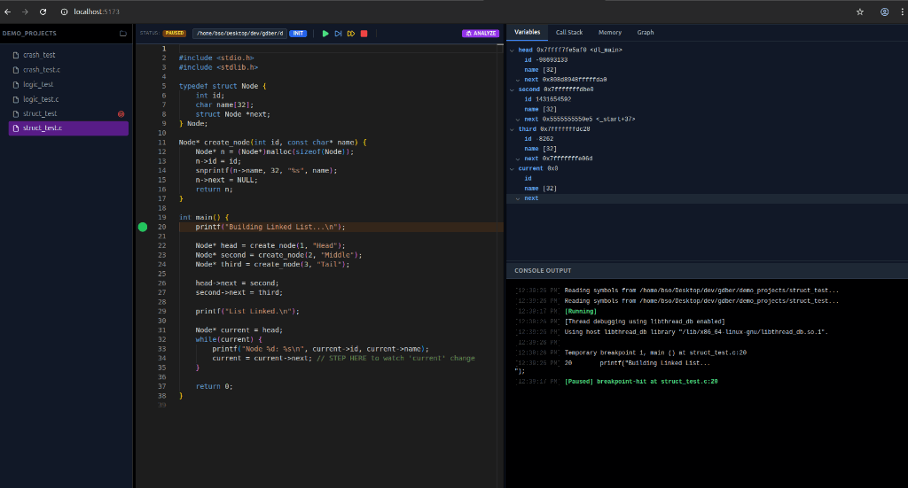

# GDBer: The AI-Powered Visual Debugger

**GDBer** is a next-generation web interface for the GNU Debugger (GDB), designed to modernize the low-level C/C++ debugging experience.

It goes beyond standard debugging by integrating **Real-Time Memory Visualization** and **AI-Driven Crash Analysis**, transforming how developers understand complex systems code.


<div align="center">
  
</div>

## Key Features

### 1. Interactive Memory Graph
Stop debugging Linked Lists and Trees by staring at hex addresses.
*   **Visual Pointers**: GDBer parses raw memory addresses in real-time and constructs a directed graph of your data structures.
*   **Auto-Linking**: Automatically detects relationships (e.g., `head->next`) and draws connections between nodes.
*   **Deep Inspection**: Expand specific nodes to trace complex pointer chains visually.

### 2. AI-Powered Crash Analysis
Don't just see *where* it crashed—understand *why*.
*   **RAG Architecture**: Uses Retrieval-Augmented Generation to search your codebase for relevant context when a crash occurs.
*   **Local AI**: Integrates with **Ollama** (Llama 3, Phi-3) to provide private, offline explanations for Segfaults and Logic Errors.
*   **Smart Context**: Automatically prioritizes the active file and stack trace to give precise answers.

### 3. ⚡ Cloud-Native Web Interface
A full IDE-like experience in the browser.
*   **Zero-Setup client**: Debug from any device with a browser.
*   **Real-Time Sync**: Low-latency WebSockets sync stack frames, variables, and register states instantly.
*   **Session Persistence**: Refreshing the page doesn't kill your debug session. Reconnect instantly to running processes.

### 4. Advanced Engineering
*   **Secure**: Implements strict file access controls and size limits.
*   **Performance**: Lazy-loading file systems and persistent RAG caching for instant startup.
*   **Robust**: Handles complex GDB states, multi-threaded output, and relative/absolute path resolution quirks.

---

## Tech Stack

**Frontend**
*   **React 19 & TypeScript**: For a blazing fast, type-safe UI.
*   **React Flow**: For the interactive Memory Graph visualization.
*   **Monaco Editor**: VS Code's editor engine embedded for code viewing.
*   **TailwindCSS**: For a modern, dark-mode-first aesthetic.

**Backend**
*   **FastAPI (Python)**: High-performance async gateway.
*   **WebSockets**: For bidirectional, real-time GDB communication.
*   **ChromaDB**: Vector store for codebase indexing and RAG.

**Systems**
*   **GDB/MI**: Direct interaction with the GDB Machine Interface via PTYs.
*   **Ollama**: Local LLM inference server.

---

## Quick Start

1.  **Prerequisites**: Linux, GDB, Python 3.10+, Node.js, Ollama.
2.  **Start Services**:
    ```bash
    ./run_services.sh
    ```
3.  **Open Browser**:
    Navigate to `http://localhost:5173`

4.  **Debug**:
    *   Select a C file (e.g., `demo_projects/struct_test.c`).
    *   Click **INIT** -> **RUN**.
    *   Switch to the **Graph** tab to see your data structures come to life!
